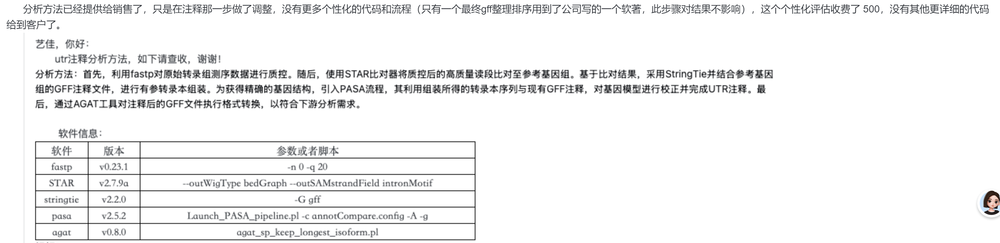

# TSS/UTR 注释流程图整理与可行性评估

## 1. 结论

该流程可以在特定条件下生成 `five_prime_UTR` 和 `three_prime_UTR` 注释，但不能按宣传口径直接视为“筛出高置信 TSS”。更准确的表述是：

| 目标 | 该流程能否完成 | 置信层级 | 判断 |
| --- | --- | --- | --- |
| 普通 RNA-seq 质控、比对、转录本组装 | 能 | 已知 | fastp、STAR、StringTie 是常规组合。 |
| 基于转录本边界和 CDS 生成 UTR 注释 | 条件性可以 | 已知 | PASA 明确支持用转录本比对更新注释并添加 UTR；前提是转录本边界可靠。 |
| 精准定位实验 TSS | 不能直接完成 | 已知 | 该流程没有 CAGE、RAMPAGE、dRNA-seq、TSS-seq、Cappable-seq 等 5' 端富集证据。 |
| 从公共数据中筛 TSS 专用数据 | 不能 | 已知 | 图中流程是注释执行流程，不是 SRA/公共数据筛选流程。 |
| 生成 TSS 候选位点 | 可以作为低/中置信候选 | 推断 | 可把 5' UTR 的转录本起点当候选 TSS，但需要额外 5' 端证据验证。 |

核心风险：普通 RNA-seq 的 read coverage 只能支持“转录区域被表达”，不能证明 read 覆盖边界就是真实转录起始位点。若研究目标是启动子、TSS、5' UTR 长度、leaderless transcript 或调控元件，该流程只能作为候选生成，不足以作为最终证据。

## 2. 流程图内容转写

原图位置：

```text
tss/resources/tss注释流程.png
```



图中说明该分析方法已提供给销售，只在注释步骤做了调整；没有更多个性化代码和流程。最终 GFF 整理排序使用了公司自写软件，图中文字认为该步骤不影响结果；个性化评估收费 500，未提供更详细代码。

### 2.1 图中分析流程

```text
原始转录组测序数据
  -> fastp 质控
  -> STAR 比对到参考基因组
  -> StringTie + 参考基因组 GFF 注释，进行有参转录本组装
  -> PASA 使用组装转录本序列和现有 GFF 注释校正基因模型，并完成 UTR 注释
  -> AGAT 对注释后的 GFF 做格式转换或整理
  -> 下游分析使用的 GFF/GTF
```

### 2.2 图中软件与参数

| 软件 | 图中版本 | 图中参数或脚本 | 图中定位 |
| --- | --- | --- | --- |
| fastp | v0.23.1 | `-n 0 -q 20` | FASTQ 质控、过滤低质量 reads。 |
| STAR | v2.7.9a | `--outWigType bedGraph --outSAMstrandField intronMotif` | 将 reads 比对到参考基因组，并输出 bedGraph 覆盖信号。 |
| StringTie | v2.2.0 | `-G gff` | 使用参考注释指导转录本组装。 |
| PASA | v2.5.2 | `Launch_PASA_pipeline.pl -c annotCompare.config -A -g` | 比较转录本证据与现有注释，更新基因结构并添加 UTR。 |
| AGAT | v0.8.0 | `agat_sp_keep_longest_isoform.pl` | 每个 locus/基因保留一个最长 isoform。 |

## 3. 本地示例文件检查

检查对象：

```text
tss/resources/S1.genome.gff
tss/resources/S1.genome_new.gff3
tss/resources/S1.genome.fasta
```

### 3.1 原始 GFF 与新 GFF 差异

| 文件 | gene | mRNA | exon | CDS | five_prime_UTR | three_prime_UTR | TSS/promoter 显式特征 |
| --- | ---: | ---: | ---: | ---: | ---: | ---: | ---: |
| `S1.genome.gff` | 10,370 | 10,370 | 15,321 | 15,321 | 0 | 0 | 0 |
| `S1.genome_new.gff3` | 10,367 | 10,367 | 15,477 | 15,272 | 3,051 | 2,922 | 0 |

本地示例说明：该流程确实产出了 UTR 类 GFF3 特征，但没有产出明确的 `transcription_start_site`、`TSS` 或 `promoter` 特征。

### 3.2 UTR 覆盖范围

| 指标 | 数值 |
| --- | ---: |
| UTR feature 总数 | 5,973 |
| 有任意 UTR 的 mRNA | 2,978 |
| 有 5' UTR 的 mRNA | 2,887 |
| 有 3' UTR 的 mRNA | 2,883 |
| 同时有 5' 和 3' UTR 的 mRNA | 2,792 |
| UTR feature 最短长度 | 1 bp |
| UTR feature 最长长度 | 11,841 bp |
| UTR feature 平均长度 | 355.95 bp |

需要注意：存在 1-3 bp 的极短 UTR feature，例如 `nbis-five_prime_utr-*` 和 `nbis-three_prime_utr-*`。这类记录可能是边界推断、格式修复或 CDS/mRNA 坐标差异造成的最小片段，不能直接当作生物学上有意义的 UTR，需要单独过滤或人工复核。

## 4. 工具能力分析

### 4.1 fastp

| 项目 | 判断 |
| --- | --- |
| 主要功能 | FASTQ 质控、过滤、接头剪切、低质量碱基剪切、报告生成。 |
| 对 UTR 的作用 | 间接作用。提高后续比对和组装质量。 |
| 对 TSS 的作用 | 无直接作用。不会识别 TSS。 |
| 图中参数风险 | `-n 0` 会丢弃含 N reads；`-q 20` 设置合格碱基阈值。需确认是否还需要长度过滤、接头策略、polyG/polyX 处理。 |

判断：fastp 是必要预处理工具，但不提供 TSS/UTR 证据。

来源：fastp 官方仓库说明其定位是 FastQ 数据的 all-in-one preprocessing 和 quality control，并列出过滤、接头、polyG/polyX、UMI、HTML/JSON 报告等功能。

### 4.2 STAR

| 项目 | 判断 |
| --- | --- |
| 主要功能 | RNA-seq reads 到基因组的剪接感知比对。 |
| 对 UTR 的作用 | 提供 read alignment 和覆盖度，供 StringTie/PASA 使用。 |
| 对 TSS 的作用 | 默认普通比对不能证明 TSS；只有 5' 端专用文库配合 5' 端信号输出才可用于 TSS 峰。 |
| 图中参数风险 | `--outWigType bedGraph` 输出覆盖信号；若没有 `read1_5p` 等 5' 端信号约束，bedGraph 更像普通覆盖度，不是 TSS peak。 |
| 物种/数据风险 | `--outSAMstrandField intronMotif` 依赖内含子 motif 推断链信息，更适合有剪接结构的真核 RNA-seq；若目标是细菌数据，此参数生物学意义有限。 |

判断：STAR 是比对工具，不是 TSS 识别工具。对于 CAGE/RAMPAGE 等 5' 端数据，STAR 可以输出 5' 端信号；但图中流程没有说明数据类型是 5' 端捕获，也没有给出 TSS peak calling 步骤。

来源：STAR 参数文件说明 `outWigType bedGraph` 生成 wiggle/bedGraph signal；`read1_5p` 模式才是只用 read1 的 5' 端信号，适用于 CAGE/RAMPAGE；`outSAMstrandField intronMotif` 会按 intron motif 处理链信息。

### 4.3 StringTie

| 项目 | 判断 |
| --- | --- |
| 主要功能 | 从 RNA-seq alignment 组装和定量转录本。 |
| 对 UTR 的作用 | 通过转录本边界间接影响 UTR 长度。 |
| 对 TSS 的作用 | 只能给出组装转录本的 5' 边界，不能证明真实 TSS。 |
| 图中参数风险 | `-G` 使用参考 GFF/GTF 指导组装；结果会受参考注释强影响。 |
| 边界风险 | StringTie 默认会根据 coverage drop 调整转录本起止坐标，普通 RNA-seq 下 5' 端边界容易受覆盖不足、文库偏好、剪切和降解影响。 |

判断：StringTie 可以产生候选转录本结构，是 UTR 推断的上游证据；但它不等价于 TSS caller。

来源：StringTie 手册说明 `-G` 使用参考注释指导组装，输出表达的参考转录本和新组装转录本；`-t` 可关闭默认的转录本端部 trimming，说明端部边界本身是算法推断结果。

### 4.4 PASA

| 项目 | 判断 |
| --- | --- |
| 主要功能 | 基于 spliced transcript alignments 建模和更新真核基因结构。 |
| 对 UTR 的作用 | 明确支持添加/更新 UTR，是该流程中真正执行 UTR 注释的核心环节。 |
| 对 TSS 的作用 | 只会依据输入转录本边界更新 5' 端结构；若输入不是高质量全长/5' 端证据，则不能证明 TSS。 |
| 图中参数风险 | `-A` annotation compare/update；需要完整 `annotCompare.config`、转录本 fasta、基因组 fasta、原始 GFF。图中没有提供配置细节和过滤阈值。 |
| 适用范围 | PASA 官方定位是真核基因组注释工具；对细菌 TSS/5' UTR 研究不是首选主线。 |

判断：PASA 能让流程“产出 UTR 注释”，但可信度取决于转录本证据质量。若输入只是普通短读长 RNA-seq 组装转录本，则 UTR 边界属于候选级。

来源：PASA Wiki 明确写到其功能包括基于转录本比对自动更新基因结构，更新内容包括 UTR、外显子边界调整、可变剪接、基因合并/拆分和新基因建模；同时说明完整注释还依赖 ab initio、同源蛋白、EVM 等多证据整合。

### 4.5 AGAT

| 项目 | 判断 |
| --- | --- |
| 主要功能 | GFF/GTF 格式处理、标准化、筛选和转换。 |
| 对 UTR 的作用 | 可管理、过滤或转换已有 UTR 注释，但不是 UTR 发现工具。 |
| 对 TSS 的作用 | 无直接作用。 |
| 图中脚本风险 | `agat_sp_keep_longest_isoform.pl` 会按最长 CDS 或最长 exon 保留 isoform，可能删除真实的 alternative TSS/alternative UTR isoform。 |

判断：AGAT 是后处理工具。用于“保留最长 isoform”时要谨慎，因为 TSS/UTR 研究恰恰关心替代起始位点和替代 UTR。

来源：AGAT 文档说明其是 GFF/GTF toolkit；`agat_sp_keep_longest_isoform.pl` 的规则是每个 locus 保留最长 CDS 或最长拼接 exon 的 isoform。

## 5. 该流程为什么不能直接等价于 TSS 筛选

### 5.1 TSS 与转录本 5' 边界不是同一个证据层级

| 概念 | 需要的证据 | 普通 RNA-seq 是否足够 |
| --- | --- | --- |
| 转录区域 | reads 覆盖、剪接 junction、表达量 | 通常足够。 |
| 转录本结构 | splice junction、exon chain、覆盖连续性 | 条件性足够；长读长更好。 |
| 5' UTR | mRNA 5' 边界 + CDS 起始坐标 | 候选级；依赖转录本是否完整。 |
| TSS | 初级转录本 5' 端或 capped RNA 5' 端证据 | 普通 RNA-seq 不足。 |

5' UTR 的计算逻辑通常是：转录本外显子范围中位于 CDS 上游的部分。对于正链，5' UTR 接近 transcript start 到 CDS start；对于负链，5' UTR 接近 CDS end 到 transcript end。该坐标可以从 GFF3 中构造出来，但前提是 transcript start/end 可信。

### 5.2 图中流程缺少 TSS 专用实验和 peak calling

真 TSS 研究通常需要以下证据之一：

| 场景 | 推荐实验/数据类型 | 作用 |
| --- | --- | --- |
| 真核 capped mRNA TSS | CAGE、nanoCAGE、RAMPAGE、5' RACE | 富集 capped 5' ends，定位 promoter/TSS。 |
| 细菌 primary transcript TSS | dRNA-seq、TSS-seq、Cappable-seq、5' RACE | 区分 primary 5' end 与 processed RNA end。 |
| 转录本完整结构 | PacBio Iso-Seq、ONT cDNA/direct RNA、TALON/FLAIR/StringTie long-read mode | 改善 isoform 和 UTR 边界。 |
| 3' UTR / polyA site | 3' end-seq、PAT-seq、PolyA-seq、direct RNA | 更可靠地确定转录终止或 polyA 相关边界。 |

图中没有给出这些信息：

1. 文库是否为链特异性。
2. 是否为 5' 端富集或 capped RNA 捕获。
3. 是否有 biological replicate。
4. 是否有 TSS peak caller。
5. 是否有 motif/promoter sanity check。
6. 是否有 IGV/manual curation 或正交验证。
7. 是否有 PASA config、StringTie 参数完整列表、过滤阈值。
8. 是否保留多 isoform，还是只保留 longest isoform。

## 6. 对“可以筛出 TSS/UTR”这句话的审计结论

| 宣传说法 | 审计后改写 | 可信度 |
| --- | --- | --- |
| 可以筛出 UTR | 可以生成基于 RNA-seq 组装转录本和 PASA 更新的候选 UTR 注释。 | 中等；需检查转录本证据和边界质量。 |
| 可以筛出 TSS | 不能直接筛出实验 TSS；最多从 5' UTR/mRNA 起点推断候选 TSS。 | 低；需 5' 端专用数据验证。 |
| 流程对结果可靠 | 流程工具本身合理，但缺少关键参数、配置、数据类型和验证标准。 | 待验证。 |
| 最终 GFF 排序不影响结果 | 格式排序通常不改变坐标，但如果自写软件做了合并、过滤、ID 重写或最长转录本筛选，就会影响结果。 | 待验证。 |

## 7. 如果目标是“开始研究怎么筛 TSS”，建议路线

### 7.1 数据筛选优先级

| 优先级 | 数据关键词 | 适用目标 |
| --- | --- | --- |
| P0 | `CAGE`, `nanoCAGE`, `RAMPAGE`, `TSS-seq`, `dRNA-seq`, `Cappable-seq`, `5' RACE` | 真 TSS 数据。 |
| P1 | `Iso-Seq`, `PacBio`, `Nanopore direct RNA`, `full-length cDNA`, `R2C2` | 完整 transcript/UTR 边界。 |
| P2 | `strand-specific RNA-seq`, `RNA-Seq`, `polyA`, `rRNA depletion`, `total RNA` | 候选 UTR、表达和转录区域。 |
| P3 | 普通 non-stranded RNA-seq | 只适合作表达/粗略转录区域支持，不建议做 TSS。 |

### 7.2 对公共 SRA 的筛选字段

筛数据时不要只看 `LibraryStrategy = RNA-Seq`。应同时检查：

| 字段 | 用途 |
| --- | --- |
| `library_strategy` | 初筛 RNA-seq、CAGE、OTHER 等。 |
| `library_source` | 判断 transcriptomic / genomic / metagenomic。 |
| `library_selection` | polyA、cDNA、size fractionation、RACE、cap-trap 等信息。 |
| `library_name` / `experiment_title` / `study_title` | 搜索 `CAGE`、`RAMPAGE`、`TSS`、`dRNA-seq`、`Cappable`、`5 prime`。 |
| `sample_attribute` | 组织、条件、菌株、处理条件。TSS 具有条件特异性。 |
| `platform` / `layout` / `read_length` | 判断是否适合 5' 端定位或转录本组装。 |

### 7.3 对本项目下一步的最低可执行验证

1. 确认目标生物：真核微生物、植物、动物、细菌需走不同路线。
2. 从 SRA 元数据中按关键词筛 P0/P1 数据，而不是只筛普通 RNA-seq。
3. 对已有 `S1.genome_new.gff3` 做 UTR 质量审计：
   - 过滤 1-3 bp 极短 UTR。
   - 统计 5' UTR 长度分布、3' UTR 长度分布。
   - 检查 longest isoform 是否丢失 alternative UTR。
   - 随机抽样 IGV 查看 read coverage 是否支持边界。
4. 如果只有普通 RNA-seq，把输出命名为 `candidate_UTR` / `candidate_TSS`，不要命名为 `validated_TSS`。
5. 若要构建 TSS 训练集，应优先收集 CAGE/dRNA-seq/TSS-seq/Cappable-seq，普通 RNA-seq 只能作为辅助特征。

## 8. 参考来源

| 来源 | 链接 | 用途 |
| --- | --- | --- |
| fastp 官方仓库 | https://github.com/OpenGene/fastp | 确认 fastp 是 FASTQ 质控/预处理工具。 |
| STAR 参数文件 | https://raw.githubusercontent.com/alexdobin/STAR/master/source/parametersDefault | 确认 `outWigType bedGraph`、`read1_5p`、`outSAMstrandField intronMotif` 的含义。 |
| StringTie 手册 | https://ccb.jhu.edu/software/stringtie/index.shtml?t=manual | 确认 `-G`、转录本组装、端部 trimming 逻辑。 |
| PASA Wiki | https://github.com/PASApipeline/PASApipeline/wiki | 确认 PASA 用于真核基因结构更新、UTR 添加和转录本比对证据整合。 |
| AGAT 文档 | https://agat.readthedocs.io/en/latest/ | 确认 AGAT 是 GFF/GTF 工具集。 |
| AGAT longest isoform | https://agat.readthedocs.io/en/latest/tools/agat_sp_keep_longest_isoform.html | 确认 `agat_sp_keep_longest_isoform.pl` 的筛选规则。 |
| FANTOM5 promoter atlas | https://www.nature.com/articles/nature13182 | CAGE/TSS 层级证据参考。 |
| H. pylori dRNA-seq | https://www.nature.com/articles/nature08756 | 细菌 primary transcriptome/TSS 证据参考。 |
